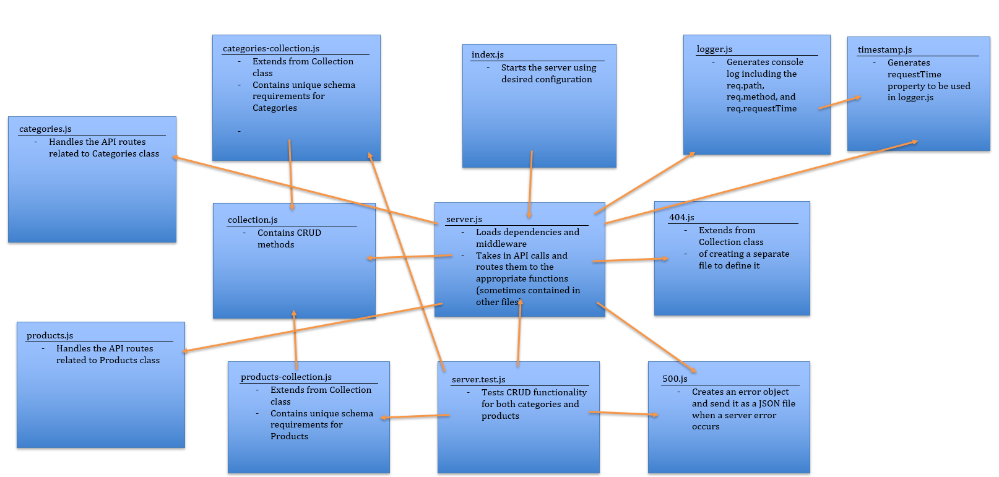

# LAB - Express Routing & Connected API

## Create well architected, multiple resource (model) API server, connected to a Mongo Database

### Author: Earl Jay Caoile

### Links and Resources
* [submission PR](https://github.com/js-401n15-eoc/lab-08/pull/1)
* [GitHub Actions](https://github.com/js-401n15-eoc/lab-08/actions)

#### Documentation
* [MongoDB docs (MongoDB CRUD Operations)](https://docs.mongodb.com/manual/crud/)

### Setup
#### Tests
* Testing command: `npm test` from root directory

#### UML
